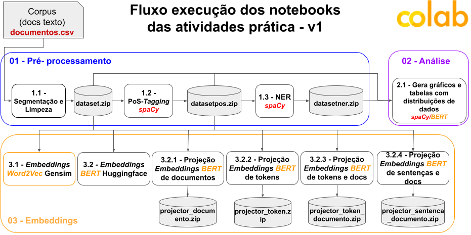

# Análise de Textos - SRI

Projeto desenvolvido para a disciplina Tópicos Especiais I.

## Descrição

O conjunto de dados utilizado foi obtido por meio da plataforma Hugging Face, composto por tweets curtos em português (miguelribeirokk/crime_tweets_in_portuguese). Desse conjunto, foi selecionado um corpus contendo 50 documentos para análise do texto.

## Fluxo de execução dos notebooks

## Etapas

- Limpeza e segmentação dos textos
- POS Tagging (classificação gramatical)
- NER (reconhecimento de entidades nomeadas)
- Análise de dados com gráficos e tabelas
- Geração de embeddings utilizando Word2Vec e BERT
- Projeção de documentos, tokens e sentenças

## Tecnologias

- Python
- Pandas
- spaCy
- Gensim
- Hugging Face
- Google Colab

## Estrutura

- `data/`: arquivos CSV e arquivos gerados durante o processamento
- `projecao/`: arquivos gerados para visualização das projeções de embeddings
- Notebooks na raiz do projeto para processamento e análise

##
